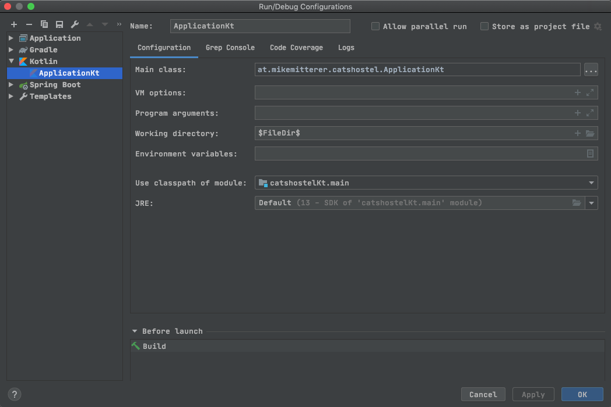

# CatsHostel (Udemy - Kurs)
> [Udemy](https://www.udemy.com/course/web-development-with-kotlin/)  
> [GH Repo](https://github.com/AlexeySoshin/KotlinWebDevelopment)  
> [MyBatis](https://blog.mybatis.org/)    

## Auto-Refresh
> [KTor - AutoReload](https://ktor.io/servers/autoreload.html)

Die ganze Geschichte muss unter **Java > 8** laufen!

Parallel in einem Console-Fenster

    # Consol-Windows 1
    gradle -t installDist
    
    # Consol-Windows 2
    gradle run
    
starten    

## Database

    # cd to DB-Directory
    cd resources/db
    
    # Import schema (Postgres works just fine here)
    sqlite catshostel.db < ../../docker/db/test/config/docker-entrypoint-initdb.d/postgres-1-schema.sql

Set your working dir to $MODULE_WORKING_DIR$

## Application
> [Fertige App im GH-Repo](https://github.com/AlexeySoshin/KotlinWebDevelopment/tree/chapter9-10)
    
    gradle run
    
## WebSocket
> [KTOR.io - WebSockets](https://ktor.io/servers/features/websockets.html)    
> [Chat-Example](https://ktor.io/samples/app/chat.html)
> [How to implement a chat with WebSockets](https://ktor.io/quickstart/guides/chat.html)   

## FatJar
> [Shadow-Plugin](https://imperceptiblethoughts.com/shadow/)
> [KTor-Doku (schwach)](https://ktor.io/servers/deploy/packing/fatjar.html)

    # Erstellt das JAR
    gradle shadowJar
    
    